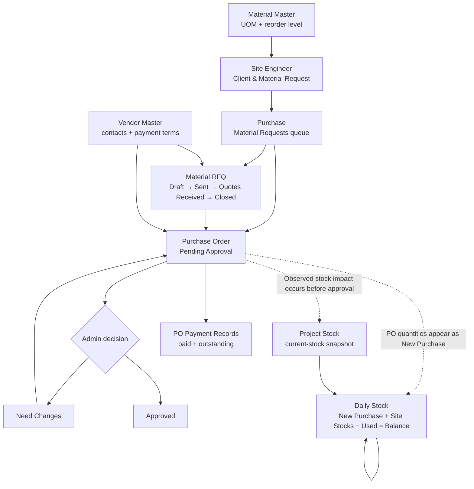

# Inventory Management Functional Analysis

Source instance: `https://reliable.s.frappe.cloud/app/erp-dashboard`  
Analysis date: 2026-07-03  
Scope: Functional behavior, user workflows, control points, and operational risks

## Executive Summary

The inventory system is a custom, project-oriented construction-material workflow spread across four application areas:

1. **Site Engineer** captures material demand and daily consumption.
2. **Purchase** manages materials, vendors, RFQs, purchase orders, and project-stock snapshots.
3. **ERP Dashboard** provides activity, approval, and alert views.
4. **Purchase Order records** carry their own payment tracking; the Finance workspace does not expose a direct purchasing integration.

The intended business flow is:

```text
Material master + vendor master
            ↓
Site engineer material request
            ↓
Purchase material-request queue
        ↙           ↘
      RFQ        Direct PO
        \           /
         Purchase Order
                ↓
        Project stock inflow
                ↓
    Daily site usage and balance
```

The system supports the basic operational chain, but the inspected instance has several material control gaps:

- A purchase order can affect stock while it is still `Pending Approval`.
- No goods-receipt, GRN, partial receipt, rejected quantity, or receipt-verification step was found.
- Project Stock is an editable balance record rather than a derived, immutable movement ledger.
- The Project Stock balance did not reconcile with the Daily Stock balance in the inspected sample.
- Units of measure can differ between Material Master, PO lines, Project Stock, and Daily Stock.
- Last Purchase Price remained zero despite approved POs containing non-zero rates.
- RFQs do not provide a structured per-vendor quote-comparison and award workflow.

The module is therefore usable as a lightweight project-material tracker, but not yet reliable as an auditable inventory-control system.

## 1. Functional Boundaries

### Included

- Material and vendor masters
- Site material demand
- Material-request queue
- RFQ preparation and status tracking
- Purchase-order preparation and approval
- Project-level stock snapshot
- Daily stock inflow, usage, and balance
- Reorder levels and alert intent
- Purchase-order payment tracking
- User roles and project restrictions

### Not Found

- Warehouses or storage locations
- Goods Receipt Note / Purchase Receipt
- Partial delivery tracking
- Rejected or damaged receipt quantities
- Stock transfers between projects/sites
- Stock reservations
- Batch or serial tracking
- Stock valuation methods
- Cycle counting or physical-stock reconciliation
- Adjustment reasons and approval
- Supplier returns
- Purchase invoices or three-way matching
- A dedicated stock-movement audit ledger

## 2. Inventory Components

| Component | Workspace | Functional Role |
|---|---|---|
| Material Master | Purchase → Materials | Defines materials, codes, categories, UOM, reorder level, description, and last purchase price |
| Vendor | Purchase → Vendors | Defines suppliers and payment/contact terms |
| Client and Material Request | Site Engineer → Site Ops | Captures project/site demand from engineers |
| Material Requests view | Purchase → Material Requests | Flattens requested material lines into a purchasing queue |
| Material RFQ | Purchase → RFQ | Records requested items, contacted vendors, and a manually managed RFQ status |
| Project Purchase Order | Purchase → Purchase Orders | Records vendor commitment, quantities, rates, approval, payment, and delivery details |
| Project Stock | Purchase → Stock | Stores current quantity by project and material |
| Daily Stock report | Site Engineer → Daily Stock | Combines daily purchase inflow, opening/site stock, usage, and closing balance |
| ERP Dashboard | ERP Dashboard | Surfaces open POs, recent activity, pending reviews, and alerts |

## 3. End-to-End Workflow



The dotted connections represent the behavior observed in the live instance, not the recommended control model.

## 4. Master Data

### 4.1 Material Master

Each material contains:

- Material Name
- Material Code
- Category
- Unit of Measure
- Reorder Level
- Description / Specifications
- Last Purchase Price
- Notes

Supported material categories:

- Plumbing
- Electrical
- Civil
- Sanitary
- Woodwork
- Painting
- Flooring
- Roofing
- Hardware
- Miscellaneous

Supported units:

- Nos
- Mtr
- Kg
- Ltr
- Sqft
- Cft
- Cum
- Set
- Pair
- Bag
- Box
- Roll
- Sheet
- Length

Functional observations:

- Material Master supplies the material identity and expected UOM.
- Reorder Level is intended to alert when project stock falls below the configured quantity.
- Last Purchase Price is displayed in both the master and material listing.
- In the inspected data, Last Purchase Price remained `₹0.00` even where approved POs had non-zero item rates.
- The system allows a material's UOM to diverge from UOMs already stored on PO and stock records.

### 4.2 Vendor Master

Each vendor contains:

- Vendor Name
- Vendor Code
- GSTIN
- Contact Person
- Mobile
- Email
- Address
- Credit Days
- Payment Terms Description
- Notes

The vendor is selected on a PO and can also be listed under an RFQ's Vendors Contacted table.

## 5. Demand Capture

### 5.1 Site Engineer Request

Site engineers create a `Client and Material Request` containing:

- Request date
- Plant/work description
- Project
- Total number of days
- Engineer name
- Client requirements
- Material requirements
- Notes

Each material-requirement row contains:

- Material
- Description / Specification
- Total Quantity
- Required On or Before date

### 5.2 Purchase Material-Request Queue

The Purchase workspace exposes requested materials as a flattened table:

- Date
- Project
- Material
- Quantity
- Required-before date
- Workflow actions

Available actions:

- `View CMR`: opens the source Client and Material Request
- `→ RFQ`: begins an RFQ path
- `→ PO`: begins a direct purchase-order path

Functional characteristics:

- A single site request with multiple material lines appears as multiple queue rows.
- The queue does not show the source request number as a dedicated column.
- Direct PO conversion allows RFQ to be bypassed.
- Converted RFQs and POs retain source-request traceability in their Notes field.
- Existing converted POs can contain a subset of the source request's material lines, supporting vendor-based splitting.

Conversion actions were not executed during this review because they may create new records. Their exact save boundary was therefore not tested.

## 6. RFQ Workflow

### 6.1 RFQ Contents

An RFQ contains:

- RFQ Date
- Project
- Company
- Material Type / Category
- Status
- Quote Valid Until
- Requested items
- Vendors contacted
- Notes / delivery instructions

Requested-item fields:

- Material
- Material Name
- Quantity
- Unit
- Unit Price

Vendor-contact fields:

- Vendor Name
- Mobile
- Sent Date
- Status

### 6.2 RFQ States

The RFQ status is a manually editable selection:

```text
Draft → Sent → Quotes Received → Closed
```

No dedicated action-based state transition was found on an existing RFQ. The user edits the Status field and saves.

### 6.3 RFQ Limitations

- Unit Price is stored at the requested-item level, not as a price per vendor.
- Vendors Contacted does not contain quoted rates, quantities, taxes, delivery terms, or award decisions.
- No side-by-side quote comparison was found.
- No RFQ approval action was found on the RFQ record.
- Existing RFQs can show a required Company field with no value, indicating legacy invalid data or weak enforcement.
- The PO contains a `Supplier Quotation Ref`, but no supplier-quotation listing is exposed in the Purchase workspace and inspected POs did not use it.

The RFQ therefore behaves mainly as a request/status document, not a full competitive-bidding workflow.

## 7. Purchase-Order Workflow

### 7.1 PO Contents

A purchase order contains:

- PO Date
- Project
- Company
- Material Type
- Delivery Date
- Vendor
- Supplier Quotation reference
- Credit Days
- Delivery Address
- Item quantities, UOMs, and rates
- GST and freight
- Purchase contact
- Site-delivery contact
- Additional terms
- Notes
- Payment records

The Notes field preserves a readable source trail when the PO originates from a Site Engineer request.

### 7.2 Approval States and Actions

New POs begin in:

```text
Pending Approval
```

For a pending PO, the administrator-facing Actions menu contains:

- Approve
- Need Changes

The Approval tab contains:

- Approval Status
- Admin Notes / Comments

An approved PO no longer exposes the Approve/Need Changes Actions menu.

Observed state model:

```text
Pending Approval ──Approve──────→ Approved
        │
        └──Need Changes─────────→ revision path
```

The exact revision/resubmission transition after `Need Changes` was not executed.

### 7.3 PO Output

The View action renders a printable purchase-order document containing:

- Company identity
- PO number and date
- Delivery date
- Project
- Vendor and delivery address
- Item quantities, rates, and amounts
- Total
- GST wording
- Payment terms
- Authorized-signatory area

A DOCX attachment/download is available.

### 7.4 Payment Tracking

The PO includes a Payment Records child table:

- Payment Date
- Amount Paid
- Payment Mode
- Reference / Cheque Number

It calculates:

- Total Paid
- Outstanding Amount
- Payment Status

No separate purchase-invoice or finance-payable workflow was found in the Finance workspace. Payment tracking appears to remain inside the PO.

## 8. Stock Inflow Behavior

### 8.1 Observed Trigger

The inspected instance indicates that saving a PO updates stock without waiting for approval:

- A Project Stock record's `Last PO` pointed to a PO still marked `Pending Approval`.
- The same PO's quantity was visible as `New Purchase` in Daily Stock.
- The Project Stock record had already been updated on the PO date.

This means one of the following is true:

1. Pending purchase commitments are intentionally treated as physical stock, or
2. Stock is updated too early in the workflow.

Because there is no separate ordered/in-transit quantity, the application presents these quantities as stock on site. Functionally, this overstates physical availability until delivery occurs.

### 8.2 Missing Receipt Control

No function was found for:

- Goods received date
- Quantity ordered versus quantity received
- Partial receipt
- Rejected quantity
- Delivery challan
- Receiver/site-engineer confirmation
- Quality acceptance
- Supplier return

The PO acts as both procurement commitment and stock-inflow source.

## 9. Project Stock

### 9.1 Purpose

Project Stock stores one current-state record with:

- Project
- Material
- Material Name
- Unit
- Current Stock
- Reorder Level
- Last Updated
- Last PO

### 9.2 Functional Behavior

- Stock is maintained per project/material combination.
- `Last PO` links the balance to the most recent PO used to update it.
- Current Stock is directly editable.
- Unit is directly editable.
- Reorder Level is directly editable.
- Last Updated and Last PO are also editable.
- Users can create Project Stock records manually from the Purchase workspace.

This is a mutable snapshot, not a movement-derived ledger.

### 9.3 Consequences

- Manual edits can alter stock without a movement type or reason.
- The balance cannot be reconstructed solely from receipts and issues.
- Corrections are indistinguishable from operational movements except through generic document history.
- Duplicate project/material stock records may be possible; uniqueness was not tested.
- Deleting a stock record is exposed in the listing, though the delete confirmation and permission enforcement were not tested.

## 10. Daily Stock and Consumption

### 10.1 Report Filters

The Daily Stock tab provides:

- Project / Site selector
- From date
- To date
- Load button
- Export button

The selector uses site-oriented names, while transactional project records can include year-specific project names. This implies a mapping layer between site and project records.

### 10.2 Daily Matrix

The loaded report has one group of four columns per material:

| Column | Meaning |
|---|---|
| New Purchase | PO-derived inbound quantity for the day |
| Site Stocks | Opening/carried-forward quantity |
| Used | Quantity consumed on site; editable inline |
| Balance | Closing quantity |

Observed calculation:

```text
Balance = Site Stocks + New Purchase − Used
```

The next day's Site Stocks carries forward the previous balance.

### 10.3 Usage Entry

- `Used` is an inline numeric input for each material/date combination.
- No explicit Save button is shown in the report.
- This suggests immediate persistence on edit or blur, but persistence was not tested to avoid changing production data.
- The report is therefore both an operational consumption-entry surface and a stock-balance report.

### 10.4 Add-Button Behavior

The global Add button remains visible on the Daily Stock tab, but it opens `New Client and Material Request`, not a dedicated daily-stock entry form.

Daily Stock itself is driven by:

- PO-derived New Purchase quantities
- Inline Used quantities
- Calculated carried balances

## 11. Reorder Levels and Alerts

Two reorder settings exist:

1. Material Master Reorder Level
2. Project Stock Reorder Level

The displayed intent is to alert when project stock is at or below the threshold.

Limitations observed:

- The relationship between master-level and project-level thresholds is not explained in the UI.
- It is unclear which value takes precedence.
- No low-stock alert was present in the inspected construction dashboard state.
- The destination, recipient, and escalation path for low-stock alerts were not visible.
- If stock includes unapproved or undelivered POs, reorder alerts can be suppressed incorrectly.

## 12. Roles and Access

### 12.1 Role Profiles

Observed role profiles:

- `Site Engineer`
- `Purchase`
- Administrator/system-management access

The system also contains standard role names such as Purchase Manager, Purchase User, Stock Manager, and Stock User, but the inspected custom profiles used the simpler custom roles.

### 12.2 Functional Separation

| Role | Observed Responsibility |
|---|---|
| Site Engineer | Creates site/material requests and records daily consumption |
| Purchase | Creates and edits RFQs, POs, materials, vendors, and stock records |
| Administrator | Reviews activity and can Approve or mark a PO as Need Changes |

### 12.3 Project Restrictions

Users can be restricted through an Allowed Projects child table:

- Empty list means access to all projects.
- One or more entries restrict the user to those projects.

This is important for site engineers because Daily Stock and material requests are project-specific.

## 13. ERP Dashboard Behavior

The Admin Dashboard exposes:

- Open PO count
- Inventory alert count for another business unit
- Recent activities
- Pending reviews
- System alerts

Functional observations:

- Purchase Orders and Material RFQs appear in Recent Activities.
- Draft RFQs appear in the Pending Approvals area with Review buttons, despite RFQ records not exposing an approval action.
- Approved POs appear as System Alerts.
- The displayed `Open POs` count matched the total PO listing even though some listed POs were approved. The metric may therefore mean all non-closed POs rather than pending-approval POs.
- No construction-specific stock valuation, low-stock list, consumption trend, or reconciliation widget was visible.

## 14. Reconciliation and Data-Integrity Findings

### 14.1 Project Stock and Daily Stock Did Not Reconcile

For an inspected project/material:

- Project Stock showed a higher Current Stock balance.
- Daily Stock showed a lower closing Balance for the same period.
- Project Stock's Last PO was a pending PO already represented in Daily Stock as New Purchase.

Potential causes include:

- Manual edits to Project Stock
- Different project-to-site mapping
- Purchases outside the selected date range
- Duplicate accumulation
- Different UOMs
- Separate calculation logic

Regardless of cause, users currently have two competing stock figures.

### 14.2 UOM Integrity Is Not Enforced

In the inspected sample:

- Material Master used `Cft`.
- One approved PO line used `Nos`.
- A later PO line used `Cft`.
- Project Stock retained `Nos`.
- Daily Stock displayed the material under `Cft`.

There was no visible UOM conversion rule. Quantities can therefore be accumulated under incompatible units.

### 14.3 Price History Is Not Updating

- Approved POs contained non-zero item rates.
- Material Master Last Purchase Price remained zero.
- The Materials listing also showed zero Last Price.

This prevents reliable price history, budgeting, and reorder-cost estimation.

## 15. Strengths

- Clear project-level orientation suited to construction operations.
- Material demand originates close to the work site.
- Required-by dates are captured.
- Source-request traceability is carried into RFQ and PO notes.
- Purchase requests can be split across vendors.
- Direct PO and RFQ paths support urgent and competitive purchases.
- PO approval supports Approve and Need Changes decisions.
- Purchase and delivery contacts are explicitly captured.
- Daily consumption is easy to enter in a matrix.
- Project-level access restrictions are available.
- Printable POs and attached DOCX outputs support field operations.

## 16. Control Gaps and Risks

| Priority | Finding | Operational Risk |
|---|---|---|
| Critical | PO updates stock before approval/receipt | Undelivered or unauthorized quantities appear available |
| Critical | No goods-receipt workflow | No proof that ordered quantities reached the site |
| Critical | UOM inconsistency | Quantities can be summed incorrectly |
| Critical | Project Stock and Daily Stock do not reconcile | Users cannot identify the authoritative stock figure |
| High | Current Stock is directly editable | Unexplained adjustments and weak auditability |
| High | No immutable movement ledger | Historical balances cannot be reliably reconstructed |
| High | RFQ lacks vendor-by-vendor quote comparison | Weak procurement transparency and award control |
| High | Last Purchase Price is not updated | Cost history and purchasing decisions are unreliable |
| Medium | Direct PO bypasses RFQ | Competitive purchasing controls can be skipped |
| Medium | RFQ status is manually selected | State progression is not controlled |
| Medium | Required RFQ Company can be blank | Incomplete ownership/legal entity attribution |
| Medium | Reorder alerts depend on potentially overstated stock | Shortages can be hidden |
| Medium | PO payments are isolated from Finance | Payables and stock commitments may diverge |
| Medium | Delete actions are exposed on transactional records | Audit history may be lost if permissions allow deletion |
| Low | Dashboard PO metric label is ambiguous | Management reporting can be misread |

## 17. Recommended Target Workflow

### 17.1 Procurement

```text
Site Request
→ Purchase Review
→ RFQ or approved direct-purchase exception
→ Vendor Quotes
→ Quote Comparison
→ Award
→ PO Approval
→ PO Issued
```

### 17.2 Receipt and Inventory

```text
Approved PO
→ Goods Receipt
→ Quantity/quality verification
→ Accepted quantity posted to stock ledger
→ Partial/complete receipt status
→ Current stock derived from ledger
```

### 17.3 Consumption

```text
Opening stock
+ posted receipts
− approved site consumption
± controlled adjustments/transfers
= closing stock
```

## 18. Recommended Functional Changes

### Immediate

1. Stop updating stock from a pending PO.
2. Add a Goods Receipt / Material Receipt document.
3. Post only accepted receipt quantities to stock.
4. Enforce the Material Master's UOM on all request, RFQ, PO, stock, and consumption lines.
5. Rebuild Project Stock and Daily Stock from one movement ledger.

### Next

6. Replace editable Current Stock with controlled adjustment entries.
7. Add movement types: Receipt, Consumption, Transfer, Return, Adjustment.
8. Require reason, user, timestamp, project, material, UOM, and source document for every movement.
9. Add partial receipt and PO completion states.
10. Update Last Purchase Price from the latest accepted receipt or invoice.
11. Add vendor-specific quote lines and a comparison/award screen.
12. Separate `Ordered`, `In Transit`, `Received`, `Available`, and `Consumed` quantities.

### Reporting and Governance

13. Add a reconciliation report between PO, receipts, movement ledger, and current balance.
14. Add low-stock dashboards by project, material, and required date.
15. Clarify whether master or project reorder level takes precedence.
16. Replace deletes of posted transactions with cancellation/reversal.
17. Connect PO payment records to purchase invoices/payables in Finance.
18. Rename dashboard metrics so their inclusion rules are explicit.

## 19. Practical State Model

### Material Request

```text
Requested → RFQ path
          → Direct PO path
```

No explicit request-level completion or cancellation state was visible in the purchasing queue.

### RFQ

```text
Draft → Sent → Quotes Received → Closed
```

The status is user-selected rather than action-controlled.

### Purchase Order

```text
Pending Approval → Approved
                 → Need Changes → edited/resubmitted
```

No Issued, Partially Received, Received, Closed, or Cancelled state was found.

### Inventory

Current observed model:

```text
PO saved
→ Project Stock updated
→ Daily Stock New Purchase updated
→ Used entered inline
→ Balance calculated
```

Recommended model:

```text
Approved PO
→ Goods Receipt posted
→ Stock ledger receipt
→ Consumption/transfer/adjustment ledger entries
→ Derived balance
```

## 20. Review Boundaries

This analysis was conducted non-destructively.

The following were inspected:

- Dashboard and module navigation
- Listing structures
- Existing view dialogs
- Existing edit forms
- Approval-action menus
- Role profiles and project restrictions
- Daily Stock reports
- Cross-document source references

The following actions were deliberately not executed:

- Save
- Approve
- Need Changes
- Convert to RFQ
- Convert to PO
- Delete
- Export/download
- Edit Daily Stock Used values

As a result, the report distinguishes observed behavior from reasonable functional inference wherever a transition would have required changing production data.
